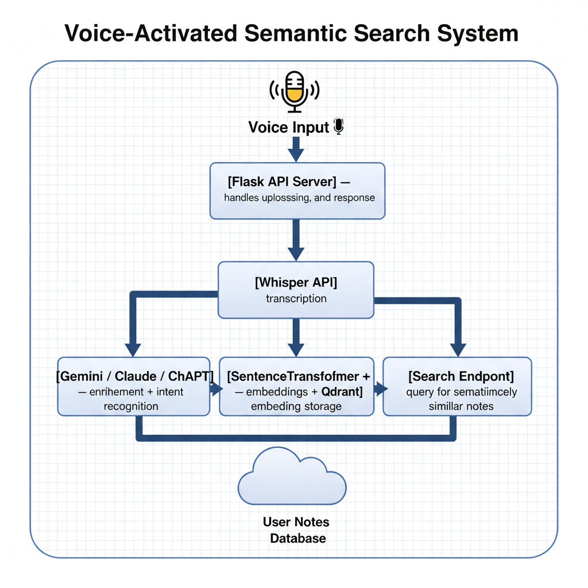

# 🧠 Voice-to-Vector AI System

A Flask-based AI system that transforms **voice notes into structured insights** and stores them in a **vector database** for semantic retrieval.  
This project demonstrates an **end-to-end intelligence pipeline** — from voice recording to actionable knowledge — integrating transcription, LLM reasoning, and vector storage.

## Architecture


---

## 🚀 Overview

The **Voice-to-Vector** system automates the process of turning spoken thoughts into searchable, structured data.

**Workflow Summary:**
1. **Voice Note Input** → uploaded or recorded audio
2. **Transcription** → processed via Whisper API
3. **AI Enrichment** → Gemini for intent recognition and tagging
4. **Vector Embedding** → stored in Qdrant using Sentence Transformers
5. **Semantic Search** → query system retrieves related insights by meaning

---

🎙️Voice Input 

     ⬇️️

💻[Flask API Server] — handles upload, processing, and response

     ⬇️

🧩[Whisper API] — transcription

     ⬇️

🤖[Gemini ] — enrichment + intent recognition

     ⬇️
  
🗄️[SentenceTransformer + Qdrant] — embeddings + vector storage

     ⬇️

🔍[Search Endpoint] — query for semantically similar notes


**Key Components**
- **Flask**: API backend handling requests and orchestration  
- **Qdrant**: Vector database storing embeddings and metadata  
- **SentenceTransformer**: Generates text embeddings  
- **LLM API (Gemini 2.5 Pro)**: AI reasoning layer for structuring and tagging insights  
- **Whisper API**: Speech-to-text transcription  


---

## 🧠 Features

- 🎙️ Transcribe voice notes automatically  
- 🪄 AI-powered enrichment and sentiment tagging  
- 🔎 Semantic search for finding related ideas and tasks  
- 🧱 Modular components: replace or extend with your own APIs  
- 📦 Local vector storage using **Qdrant**  
- ⚙️ Easily deployable with **Docker**  

---

## 🧰 Tech Stack

| Layer | Tools Used |
|-------|-------------|
| **Frontend/Input** | Local or browser-based audio recorder |
| **Backend/API** | Flask, Python |
| **AI/ML** | Whisper API, (Gemini 2.5 Pro) |
| **Vector DB** | Qdrant |
| **Embeddings** | SentenceTransformers (`all-MiniLM-L6-v2`) |

---

## 🖥️ Installation & Setup

### 1️⃣ Clone the Repository
```bash
git clone https://github.com/98Devops/Voice-to-vector.git
cd voice-to-vector
Set Up Environment Variables

Create a .env file:

QDRANT_HOST=localhost
QDRANT_PORT=6333
GEMINI_API_KEY=your_api_key_here
WHISPER_API_KEY=your_whisper_api_key_here

3️⃣ Install Dependencies
pip install -r requirements.txt

4️⃣ Run Qdrant (Docker)
docker run -p 6333:6333 qdrant/qdrant

5️⃣ Start the Flask Server
python app.py


Flask will start on http://localhost:5000
